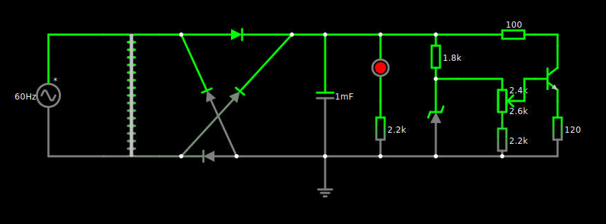
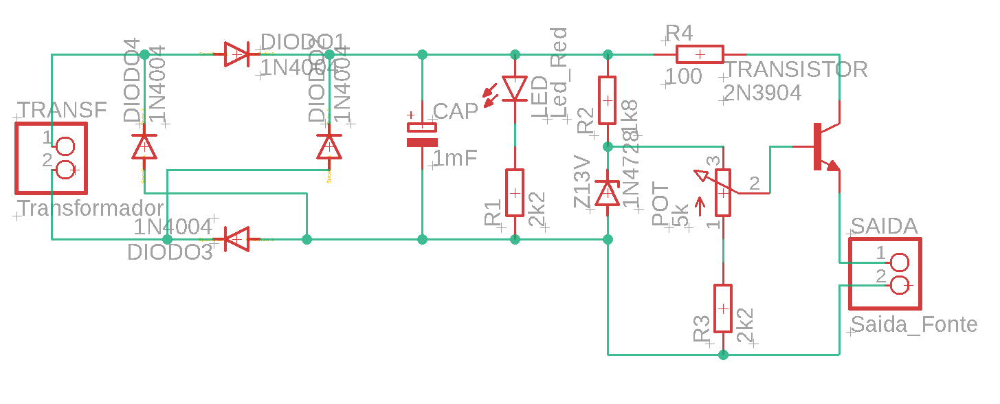
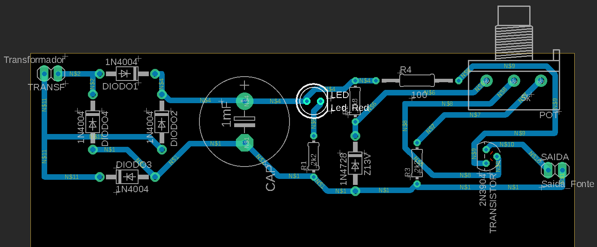

# Fonte Ajustável
&nbsp;&nbsp;&nbsp;&nbsp;Projeto de uma Fonte de Tensão ajustável entre 3V a 12V com capacidade de 100mA.
## Componentes utilizados
| Quant. | Componente | Descrição | Preço |
| :-: | :-: | :- | :-: |
| 1 | Transformador | TRANSFORMADOR 18.1VAC | R$-- |
| 4 | Diodo         | DIODO RETIFICADOR 1N4007 LGE=1N4004 | R$0.20 |
| 1 | Capacitor     | CAPACITOR ELCO 1000UFX50V 105°C 16X20 EPCOS | R$5.21 |
| 1 | LED Vermelho  | LED 5MM VM DIFUSO 333-2SDRD/S530-L PARALIGHT | R$0.50 |
| 1 | Zener         | DIODO ZENER 13V 1W = 1N4743 SEMTECH | R$0.50 |
| 1 | Potenciômetro | POTENCIÔMETRO 1W B5K B-16,5XE-20XR-7MM JH | R$7.00 |
| 1 | Resistor 100Ω | RESISTOR 2W 100R 5% METAL FILME YAGEO | R$1.20 |
| 1 | Resistor 1.8kΩ| RESISTOR CR25 1K8 CARVÃO HITANO | R$0.07 |
| 2 | Resistor 2.2kΩ| RESISTOR CR25 2K2 CARVÃO ROHS | R$0.07 |
| 1 | Transistor    | TRANSISTOR TIP41C NPN 115V 6A 3MH TO-220 FAIRC | R$3.00 |
| 1 | Protoboard    | PROTOBOARD 170F TOWER | R$6.90 |
| 5 | Jumper        | JUMPER MACHO X MACHO 20CM TOWER | R$0.70 |
| **Total** | -/- | -/- | **R$28.82** |
## Explicação para os componentes
&nbsp;&nbsp;&nbsp;&nbsp;**Transformador**: O transformador diminui a tensão da fonte de corrente alternada a fim de garantir a diferença de potencial desejada para o resto do circuito.  
&nbsp;&nbsp;&nbsp;&nbsp;**Diodos**: O conjunto de 4 diodos forma uma ponte retificadora que alimenta a fonte independentemente do ciclo da corrente alternada.   
&nbsp;&nbsp;&nbsp;&nbsp;**Capacitor**: Armazena carga elétrica a fim de liberá-la quando a tensão interna do componente é superior à tensão da corrente  
&nbsp;&nbsp;&nbsp;&nbsp;**LED**: Indica se uma corrente está passando pelo circuito no momento. Esse componente não serve propósito prático na corrente.  
&nbsp;&nbsp;&nbsp;&nbsp;**Diodo Zenner**: É um regulador que irá limitar a tensão máxima da corrente que o atravessa em 13V. Caso a tensão seja menor que o limite, o componente não irá agir.  
&nbsp;&nbsp;&nbsp;&nbsp;**Potenciômetro**: Possibilita o controle da tensão da fonte por meio de uma resistência variável. Por meio deste, a fonte alcança uma tensão mínima e máxima de 3V e 12V, respectivamente.  
&nbsp;&nbsp;&nbsp;&nbsp;**Resistor**: Os resistores limitam o fluxo da corrente a fim de impedir danos aos componentes da fonte.  
&nbsp;&nbsp;&nbsp;&nbsp;**Transistor**: Ajusta a corrente a ser alimentada pela fonte enquanto regula a corrente que atravessa o zener.
## Cálculos
### Tensão da Fonte
&nbsp;&nbsp;&nbsp;&nbsp; $V_{Fonte} \space = \space 127V$  
&nbsp;&nbsp;&nbsp;&nbsp; $V_{Pico} \space = \space 127V \space × \space \sqrt{2} \space = \space 179,6V$  
&nbsp;&nbsp;&nbsp;&nbsp; $Razão_{T} \space = \space \frac{18,1V}{127V}$  
&nbsp;&nbsp;&nbsp;&nbsp; $V_{1} \space = \space 179,6V \space × \space \frac{18,1V}{127V} \space = \space 25,6V$  
&nbsp;&nbsp;&nbsp;&nbsp; $V_{2} \space = \space 25,6V \space - \space 1,4V \space = \space 24,2V$
### Corrente da Fonte
&nbsp;&nbsp;&nbsp;&nbsp; $i_{LED} \space = \space 10,01mA, \space \space \space i_{Zener} \space = \space 3,21mA, \space \space \space i_{Potenciômetro} \space = \space 1,8mA, \space \space \space i_{Carga} \space = \space 101,7mA$  
&nbsp;&nbsp;&nbsp;&nbsp; $i_{Total} \space = \space \sum{i} \space = \space 116,72mA$
### Capacitor
&nbsp;&nbsp;&nbsp;&nbsp; $V_{Ripple} \space = \space 24,2V \space × \space 0,04 \space = \space 0,97V$  
&nbsp;&nbsp;&nbsp;&nbsp; $Capacitor \space = \space \frac{i_{Total}}{f \space × \space 2 \space × \space V_{Ripple}} \space = \space \frac{0,1167A}{60 \space × \space 2 \space × \space 0,97V} \space = \space 0.001F \space = \space 1000\mu F$  
&nbsp;&nbsp;&nbsp;&nbsp; ***Como queremos um ripple de 4%, escolhemos um capacitor de 1000µF.***
## Simulação no Falstad
&nbsp;&nbsp;&nbsp;&nbsp;  
&nbsp;&nbsp;&nbsp;&nbsp;**Link da simulação**: https://tinyurl.com/2xr4mxyp
## Eagle
| Esquemático | PCB |
| :-: | :-: |
|  |  |
## Foto da Protoboard
&nbsp;&nbsp;&nbsp;&nbsp;
## Grupo
+ Arthur de Castro Dias
+ Felipe Gausmann Socolowski
+ Gabriel Carraro Salzedas
+ Guilherme Cavalcanti de Santana
